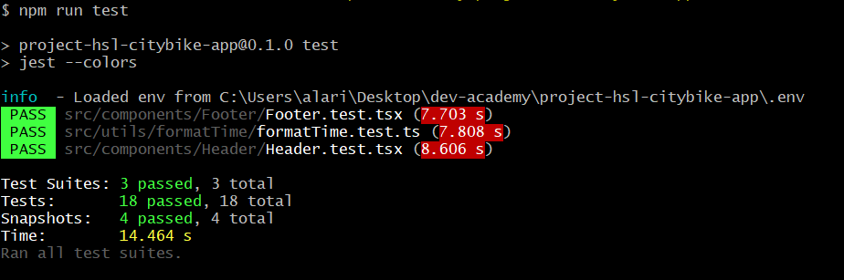
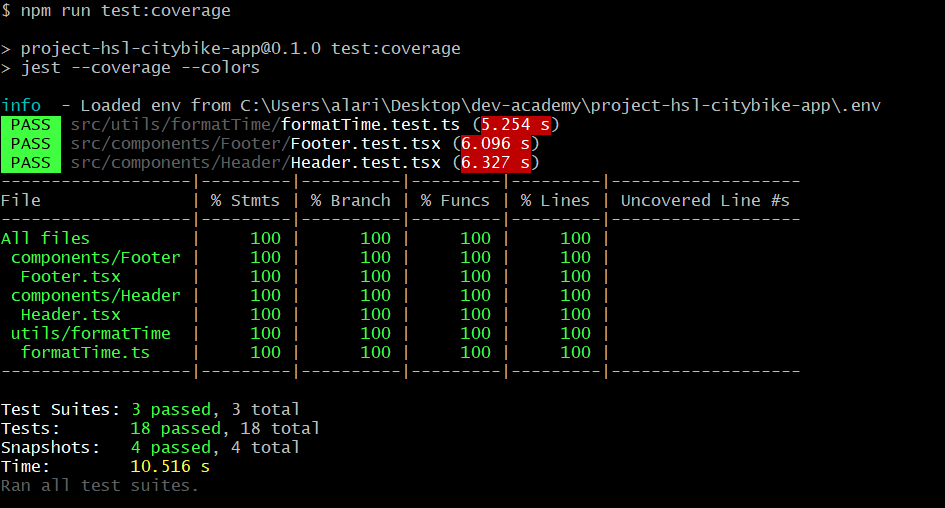

# Table of content

[Getting Started](#getting_started)
- [Spoiler](#spoiler)
- [Introduction](#introduction)

[How to start](#how_to_start)  
[Tests](#tests)  
[GitHub actions](#github_actions)  
[How it works](#how_it_works)
- [Description](#description)
- [Routes](#routes)

[In conclusion](#in_conclusion)  
[Thank you!](#thank_you)

# <a name="getting_started">Getting Started</a>

## <a name="spoiler">Spoiler</a>
It is spoiler. You can see how this application works here:
- Project [HSL citybike application](http://34.145.240.68/) at my custom google instance.

## <a name="introduction">Introduction</a>
This is "Helsinki city bike app".  

Let's imagine that you have received an interesting project offer to create a UI and a backend service for displaying data from journeys made with city bikes in the Helsinki Capital area.  

For the exercise download three datasets of journey data.  
The data is owned by City Bike Finland.  

- https://dev.hsl.fi/citybikes/od-trips-2021/2021-05.csv
- https://dev.hsl.fi/citybikes/od-trips-2021/2021-06.csv
- https://dev.hsl.fi/citybikes/od-trips-2021/2021-07.csv  

Also, there is a dataset that has information about Helsinki Region Transport’s (HSL) city bicycle stations.

- Stations: https://opendata.arcgis.com/datasets/726277c507ef4914b0aec3cbcfcbfafc_0.csv

You can see full text of this pre-assigment at the next page [Helsinki city bike app](https://github.com/solita/dev-academy-2023-exercise).

# <a name="how_to_start">How to start</a>

This public project works at NextJS with TypeScript supporting.

You have few ways how to run this application:
- You can open:
    - Project [HSL citybike application](http://34.145.240.68/) at my custom google instance.
      It is custom instance at `google.cloud` where is running docker container with this project inside.  
      That is a better way to see how this application works.
- Next way is on local machine. Create a new folder on your local machine.
    - System Requirements:
        - [NodeJS](https://nodejs.org/en/).  
          Open your terminal and type `node --version`.  
          It has to be 14.6.0 or higher.
        - `npx` 8.1.2 or higher
        - `npm` 8.1.2 or higher
        - `git`
        - `MySQL` version 5.6.26
        - (Optionally) `Docker` version 20.10.21 or higher
        - (Optionally) `Docker compose` version 2.13.0 or higher
    - Start your MySQL server.
    - Go inside created folder and run next commands:  
```
# Clone this repository  
git clone https://github.com/alari777/project-hsl-citybike-app.git .`

# Install all dependencies   
npm ci

# Attention! It is bad practice!
# It is mandatory to add `.env`, `.env.production`, `.env.development`,  
# etc files like these with secret variables in `.gitignore`.
# But it is presentation project and in order to save time
# (because for people who will see this project and they will launch it
so they will need to create this file and add variables)
# I have decided to save these files in the project and to set secret variables with default values.

# Set your credentials of MySQL for development mode in:
# - For `prisma`: `.env`
# - For development mode: `.env.development`
# - For production mode: `.env.production`

# You need to run next command once after you have cloned this project  
# in order to create the database structure via `prisma orm`.
# In that case will be created 2 tables: Stations and Trips
npx prisma db push

# In order to start this application in development mode.
# This application will start on [http://localhost:3000](http://localhost:3000)    
npm run dev 

# In order to build application and run  
npm run build  
npm start
```
- Next way is on local machine or remote server via `docker compose`. It is production mode. 
  - Create a new folder on your local/remote machine.
  - Go inside.
  - You have 2 ways how to start.
  - First way:
    - `git clone https://github.com/alari777/project-hsl-citybike-app.git .`
    - `docker-compose up -d`
  - Second way:
    - Create `docker-compose.yml` and copy there instructions from current `docker-compose.yml`
    - `docker-compose up -d`
  - In order to stop application use `docker-compose down`.
    
I need to explain it.  

The `docker-compose.yml` file consists 2 services: `prod_frontend` and `db`.  
First off will be created and started service named `db` based on MySQL image. Then database named `hsl` will be created. After it `prod_frontend` service based on image of this application will be created and started.  

This image is storing at `GitHub package repository`.      

Each merge with `main` branch (via pull requests) starts `GitHub action`. This action pushes new version of image of this application to `GitHub package repository`.  

So thus `docker-compose.yml` consists the latest version of application.

# <a name="tests">Tests</a>

To start tests: `npm run test`



To start coverage of tests: `npm run test:coverage`



# <a name="github_actions">GitHub actions</a>

After creating new `pull request` two GitHub actions: `run_tests` and `push_docker` are run.  
You can find them in folder `.github/workflows/`:
- Action `run_tests` runs tests.
- Action `push_docker` creates Docker image of this project and pushes it in GitHub package.
  This action depends on `run_tests`.

# <a name="how_it_works">How it works</a>

## <a name="description">Description</a>

This application has 3 pages and 1 slug-station page:
- The `index` (`trips`) page with trips:
  - Table with pagination by 100 trips records.
  - Two filters (and these filters work with pagination too)
- The `stations` page with stations:
  - Table with pagination by 100 stations records.
  - Link to `view` of current station.
- The `stations/[slug]` page:
  - Table with some common information about current station and 4 additional values:
    - Amount starting
    - Average staring distance
    - Amount ending
    - Average ending distance
  - Table with top 5 most popular return stations for journeys starting from the station
  - Table with top 5 most popular departure stations for journeys ending at the station
The `manage` page:
  - Import stations remotely by URL (example of this URL see here: [Introduction](#introduction))
  - Add new station manually
  - Import trips remotely by URL (examples of this URLs see here: [Introduction](#introduction))
  - Add new trip manually

In order to add stations please go on `Manage: trips and stations` page.  
Then insert this URL: `https://opendata.arcgis.com/datasets/726277c507ef4914b0aec3cbcfcbfafc_0.csv` in `URL for fetching stations` and press `Import stations`.  
Wait a little and available stations will be added in database soon.

In order to add trips please go on `Manage: trips and stations` page.  
Then insert e.g.  this URL: `https://dev.hsl.fi/citybikes/od-trips-2021/2021-05.csv` in `URL for fetching trips` and press `Import trips`.  
Wait a little and available trips will be added in database soon.  
Adding of trips is hard operation, so it was split on 2 sub-operations:
- Fetching data, prepare data and create new csv file with trips (e.g. there no trips where distance is less 10 metres or time durations is less 10 seconds).
- Adding data in database.

Of course, you can add stations and trips manually.  

After adding stations and trips you can go on `Trips` page where you can see all available trips.  
Also, you can go on `Stations` page where you can see all available stations. You can see more additional information about current station.  
For this one just move by link `view`.

## <a name="routes">Routes</a>
- Download
  - Stations
    - POST `/api/v1/download/station`. Add stations in database.  
    ```
    BODY: 
    {
      url: string;
    }
    ```
  - Trips
    - POST `/api/v1/download/trip`. Fetch trips and store these in CSV file.
      ```
      BODY:
      {
        url: string;
      }
      ```
    - GET `/api/v1/download/trip`. Save these trips in DB from CSV file.
- Stations
  - GET `/api/v1/stations/station?fid=STATION_FID`. Get station by fid.
  - POST `/api/v1/stations/station`. Create station.
      ```
      BODY:
      {
        id: number;
        nameFi: string;
        nameSwe: string;
        nameEn: string;
        addressFi: string;
        addressSwe: string;
        cityFi: string;
        citySwe: string;
        operator: string;
        capacities: number;
        coordinateX: number;
        coordinateY: number;
      }
      ```
  - DELETE `/api/v1/stations/station`. Delete station.
    ```
    BODY:
    {
      fid: number;
    }
    ```
  - PATCH `/api/v1/stations/station`. Update station.
    ```
    BODY:
    {
      fid: number;
      nameFi: string;
      nameSwe: string;
      nameEn: string;
      addressFi: string;
      addressSwe: string;
      cityFi: string;
      citySwe: string;
      operator: string;
      capacities: number;
      coordinateX: number;
      coordinateY: number;
    }
    ```
  - GET `/api/v1/stations/[slug]`. Get station by slug
- Trips
  - GET `/api/v1/trips/trip?id=TRIP_ID`. Get trip by id.
  - POST `/api/v1/trips/trip`. Create trip.
    ```
    BODY:
    {
      departureDate: Date;
      returnDate: Date;
      departureStationId: number;
      returnStationId: number;
      coveredDistance: number;
      duration: number;
    }
    ```
  - DELETE `/api/v1/trips/trip`. Delete trip.
    ```
    BODY:
    {
      id: number;
    }
    ```
  - PATCH `/api/v1/trips/trip`. Update trip.
    ```
    BODY:
    {
      departureDate: Date;
      returnDate: Date;
      departureStationId: number;
      returnStationId: number;
      coveredDistance: number;
      duration: number;
    }
    ```
- Search
  - GET `/api/v1/search/[slug]`. Searching.

# <a name="in_conclusion">In conclusion</a>

I want to improve this project:
- Add `redux` to store a state.
- Add e2e testing.
- Add singleton class for `prisma` client.

# <a name="thank_you">Thank you!</a>
